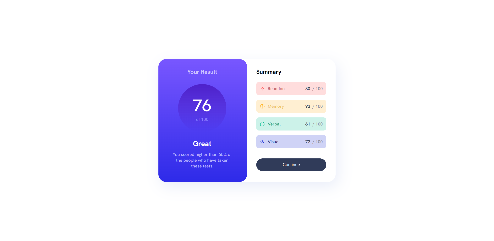
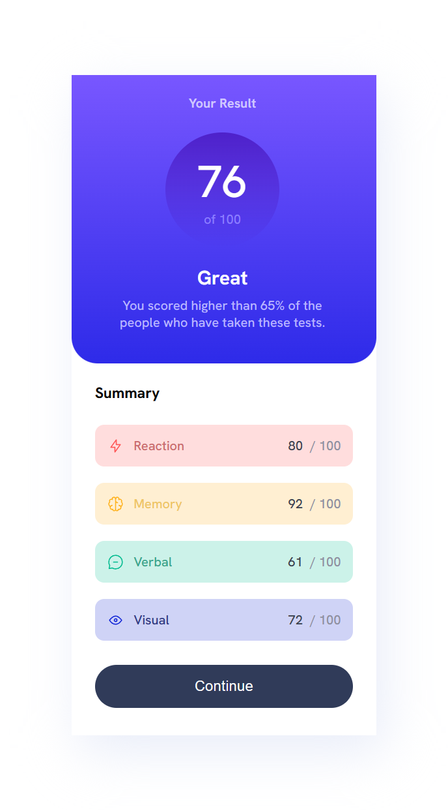

# Frontend Mentor - Results summary component

## Welcome! 👋

Thanks for checking out this front-end coding challenge.

[Frontend Mentor](https://www.frontendmentor.io) challenges help you improve your coding skills by building realistic projects.

**To do this challenge, you need a basic understanding of HTML and CSS.**

## The challenge

MY challenge was to build out this results summary component and get it looking as close to the design as possible.

I can use any tools I like to help me complete the challenge. So if I've got something I'd like to practice, I can feel free to give it a go.

## LIVE SITE:➡️https://pettik-results-summary-component.netlify.app/⬅️

# DESKTOP version 🖥️ ⬇⬇⬇

# MOBILE version 📱  ⬇⬇⬇

